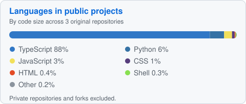

<h1 align="center">Roger Ian Konlog</h1>

  <strong>I build AI products and reliable backend systems.</strong> 
  Now building tools that make coding-agent work easier to verify.

  
  

  

---

### What I'm building

#### [Hemle](https://try.hemle.app) — *study from your own material*

Hemle helps students learn from their own study material through guided tutoring, short practice sessions, and citations they can follow back to the source.

[Try the app](https://try.hemle.app)

#### [SuperMovie](https://github.com/IanKonlog/SuperMovie) — *your media history, on your own server*

A self-hosted home for movies, series, and books: track what you watch and read, set goals, browse your history, and share a year-in-review. It runs as a single-user app with a documented setup and backup path.

[Source](https://github.com/IanKonlog/SuperMovie) · [Architecture and setup](https://github.com/IanKonlog/SuperMovie#architecture)

---

### Current focus

I'm working on tools that let developers check what coding agents claim against the work they actually performed. The goal is a clear trail from a claim to the commands, changes, and results behind it.

---

### My Stack

**Languages**

**Frameworks and runtime**

**Data and messaging**

**Cloud and developer tools**

**AI and coding agents**

---

### Activity

  

  

  

